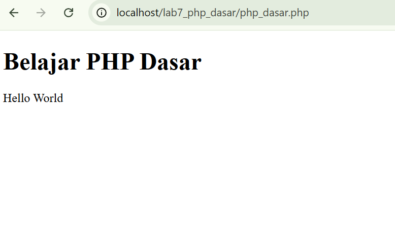
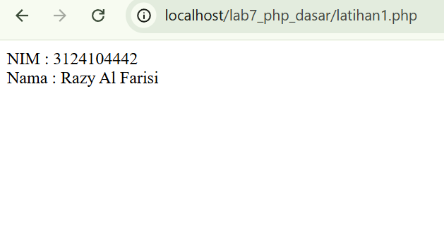
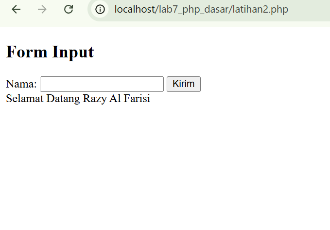
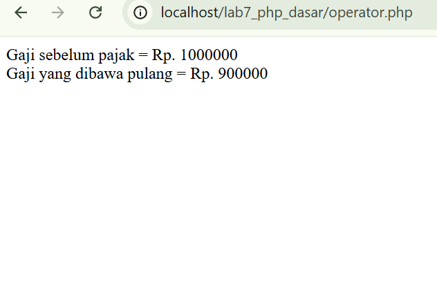
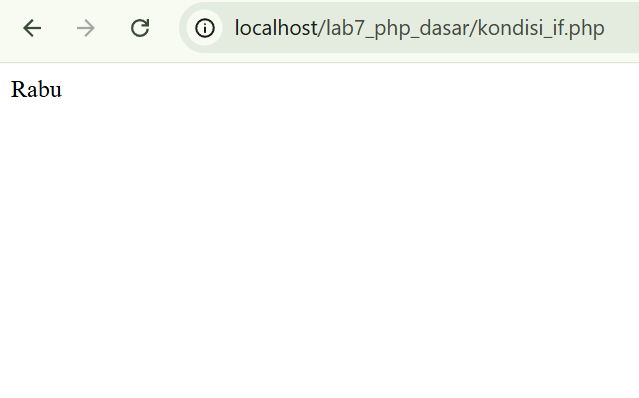
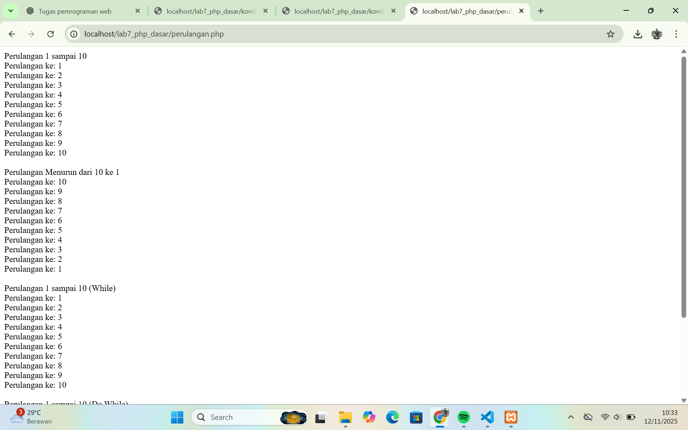
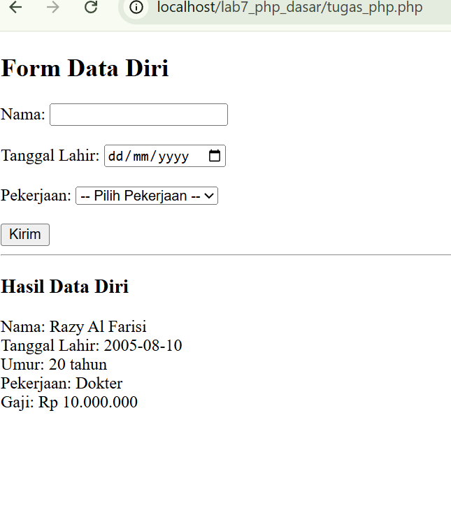

# Identitas Mahasiswa

**Nama :** Razy Al Farisi
**NIM :** 312410445  
**Kelas :** TI.24.A5  

---
## Tujuan Praktikum

1. Memahami konsep dasar Server Side Scripting menggunakan PHP.
2. Mengenal variabel dan tipe data dalam PHP.
3. Memahami penggunaan struktur kondisi dan perulangan.
4. Mampu membuat program PHP sederhana menggunakan form input.

---

##  Langkah-Langkah Praktikum

###  Persiapan Lingkungan
Sebelum menulis kode PHP, lakukan langkah berikut:
- Instal dan jalankan **XAMPP**.  
- Aktifkan **Apache** di *XAMPP Control Panel*.  
- Buat folder baru pada direktori:
  ```
  C:\xampp\htdocs\lab7_php_dasar
  ```
  Folder ini digunakan untuk menyimpan semua file praktikum.

---

###  PHP Dasar – Hello World

**File:** `php_dasar.php`  
**Tujuan:** Mempelajari dasar penulisan script PHP dan cara menampilkan output.

```php
<!DOCTYPE html>
<html>
<head><title>PHP Dasar</title></head>
<body>
<h1>Belajar PHP Dasar</h1>
<?php
    echo "Hello World";
?>
</body>
</html>
```



 **Penjelasan:**
- `<?php ... ?>` adalah tag pembuka dan penutup kode PHP.  
- `echo` digunakan untuk menampilkan teks ke layar.  
- PHP dijalankan dari server Apache, bukan dari browser langsung.

---

###  Variabel PHP

**File:** `latihan1.php`  
**Tujuan:** Mengenal variabel dan menampilkan nilainya di PHP.

```php
<?php
$nim = "312410445";
$nama = "Afdhal Agislam";
echo "NIM : " . $nim . "<br>";
echo "Nama : " . $nama;
?>
```


 **Penjelasan:**
- `$nim` dan `$nama` adalah variabel.  
- Simbol `.` digunakan untuk menggabungkan teks dan nilai variabel.  
- `<br>` digunakan untuk membuat baris baru di HTML.

---

### Form Input & Predefine Variable

**File:** `latihan2.php`  
**Tujuan:** Mempelajari cara mengirim dan menerima data dari form menggunakan `$_POST`.

```html
<!DOCTYPE html>
<html lang="en">
<head>
    <meta charset="UTF-8">
    <title>PHP Dasar</title>
</head>
<body>
<h2>Form Input</h2>
<form method="post">
    <label>Nama: </label>
    <input type="text" name="nama" value="Afdal">
    <input type="submit" value="Kirim">
</form>
<?php
if (empty($_POST['nama'])) {
    $_POST['nama'] = 'Afdal';
}
echo 'Selamat Datang ' . $_POST['nama'];
?>
</body>
</html>
```


 **Penjelasan:**
- `<form method="post">` → data dikirim ke server melalui metode POST.  
- `$_POST['nama']` → mengambil data dari input “nama”.  
- `if (empty(...))` → memberi nilai default jika belum diisi.  

---

### Operator

**File:** `operator.php`  
**Tujuan:** Mempelajari operasi aritmatika dalam PHP.

```php
<?php
$gaji = 1000000;
$pajak = 0.1;
$thp = $gaji - ($gaji * $pajak);
echo "Gaji sebelum pajak = Rp. $gaji <br>";
echo "Gaji yang dibawa pulang = Rp. $thp";
?>
```


 **Penjelasan:**
- `*` digunakan untuk operasi perkalian.  
- `$thp` menghitung gaji bersih setelah dikurangi pajak 10%.  
- `echo` menampilkan hasil ke layar.

---

###  Kondisi IF

**File:** `kondisi_if.php`  
**Tujuan:** Mengetahui cara membuat keputusan berdasarkan kondisi tertentu.

```php
<?php
$nama_hari = date("l");
if ($nama_hari == "Sunday") {
    echo "Minggu";
} elseif ($nama_hari == "Monday") {
    echo "Senin";
} elseif ($nama_hari == "Tuesday") {
    echo "Selasa";
} elseif ($nama_hari == "Wednesday") {
    echo "Rabu";
} elseif ($nama_hari == "Thursday") {
    echo "Kamis";
} elseif ($nama_hari == "Friday") {
    echo "Jumat";
} else {
    echo "Sabtu";
}
?>
```


 **Penjelasan:**
- `date("l")` mengambil nama hari (dalam bahasa Inggris).  
- `if`, `elseif`, dan `else` digunakan untuk membandingkan nilai.  
- Program menampilkan nama hari sesuai waktu sistem.

---

###  Kondisi Switch

**File:** `kondisi_switch.php`  
**Tujuan:** Alternatif dari banyak `if`, dengan struktur `switch`.

```php
<?php
$nama_hari = date("l");
switch ($nama_hari) {
    case "Sunday": echo "Minggu"; break;
    case "Monday": echo "Senin"; break;
    case "Tuesday": echo "Selasa"; break;
    case "Wednesday": echo "Rabu"; break;
    case "Thursday": echo "Kamis"; break;
    case "Friday": echo "Jumat"; break;
    case "Saturday": echo "Sabtu"; break;
    default: echo "Hari tidak diketahui"; break;
}
?>
```

 **Penjelasan:**
- `switch` mengevaluasi nilai `$nama_hari`.  
- `case` digunakan untuk tiap kondisi spesifik.  
- `break` menghentikan eksekusi setelah kondisi terpenuhi.  

---


###  Perulangan

**File:** `perulangan.php`  
**Tujuan:** Memahami struktur perulangan `for`, `while`, dan `do while`.

```php
<?php
echo "Perulangan 1 sampai 10 <br />";
for ($i = 1; $i <= 10; $i++) {
    echo "Perulangan ke: " . $i . '<br />';
}

echo "<br>Perulangan Menurun dari 10 ke 1 <br />";
for ($i = 10; $i >= 1; $i--) {
    echo "Perulangan ke: " . $i . '<br />';
}

echo "<br>Perulangan 1 sampai 10 (While) <br />";
$i = 1;
while ($i <= 10) {
    echo "Perulangan ke: " . $i . '<br />';
    $i++;
}

echo "<br>Perulangan 1 sampai 10 (Do While) <br />";
$i = 1;
do {
    echo "Perulangan ke: " . $i . '<br />';
    $i++;
} while ($i <= 10);
?>
```


 **Penjelasan:**
- `for` → digunakan jika jumlah iterasi sudah diketahui.  
- `while` → cek kondisi dulu baru jalankan.  
- `do while` → jalankan dulu baru cek kondisi.  

---

###  Tugas Akhir – Form Data Diri

**File:** `tugas_php.php`  
**Tujuan:** Menggabungkan seluruh konsep PHP (input, variabel, kondisi, dan logika).

```php
<!DOCTYPE html>
<html lang="id">
<head>
    <meta charset="UTF-8">
    <title>Tugas Akhir - PHP Dasar</title>
</head>
<body>
<h2>Form Data Diri</h2>
<form method="post">
    <label>Nama: </label>
    <input type="text" name="nama" required><br><br>
    <label>Tanggal Lahir: </label>
    <input type="date" name="tanggal_lahir" required><br><br>
    <label>Pekerjaan: </label>
    <select name="pekerjaan" required>
        <option value="">-- Pilih Pekerjaan --</option>
        <option value="Guru">Guru</option>
        <option value="Programmer">Programmer</option>
        <option value="Desainer">Desainer</option>
        <option value="Dokter">Dokter</option>
    </select><br><br>
    <input type="submit" value="Kirim">
</form>
<hr>
<?php
if ($_SERVER["REQUEST_METHOD"] == "POST") {
    $nama = $_POST['nama'];
    $tanggal_lahir = $_POST['tanggal_lahir'];
    $pekerjaan = $_POST['pekerjaan'];
    $lahir = new DateTime($tanggal_lahir);
    $hari_ini = new DateTime();
    $umur = $hari_ini->diff($lahir)->y;
    switch ($pekerjaan) {
        case "Guru": $gaji = 5000000; break;
        case "Programmer": $gaji = 8000000; break;
        case "Desainer": $gaji = 6000000; break;
        case "Dokter": $gaji = 10000000; break;
        default: $gaji = 0;
    }
    echo "<h3>Hasil Data Diri</h3>";
    echo "Nama: $nama <br>";
    echo "Tanggal Lahir: $tanggal_lahir <br>";
    echo "Umur: $umur tahun <br>";
    echo "Pekerjaan: $pekerjaan <br>";
    echo "Gaji: Rp " . number_format($gaji, 0, ',', '.');
}
?>
</body>
</html>
```


**Penjelasan:**
- Menggunakan `DateTime` untuk menghitung umur.  
- Menggunakan `switch` untuk menentukan gaji berdasarkan pekerjaan.  
- Menampilkan hasil input dalam bentuk teks HTML.

---

